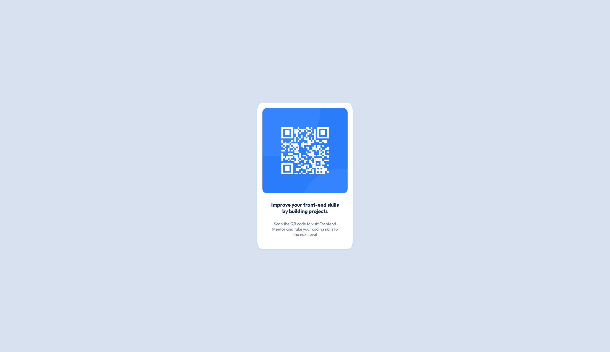

# Frontend Mentor - QR code component solution

This is a solution to the [QR code component challenge on Frontend Mentor](https://github.com/josephakayesi/qr-code-ui-component).   

Frontend Mentor challenges help you improve your coding skills by building realistic projects. 

## Table of contents

- [Overview](#overview)
  - [Screenshot](#screenshot)
  - [Links](#links)
- [My process](#my-process)
  - [Built with](#built-with)
  - [What I learned](#what-i-learned)
  - [Continued development](#continued-development)
- [Author](#author)


## Overview

### Screenshot  




### Links

- Solution URL: [Add solution URL here](https://your-solution-url.com)
- Live Site URL: [Add live site URL here](https://your-live-site-url.com)

## My process

### Built with

- Semantic HTML5 markup
- CSS custom properties

### What I learned

I learnt how to span an entire container over the height and width of the viewport

```css
.container {
    width: 100vw;
    height: 100vh;
    box-sizing: border-box;
}
```

I learnt how to center a div horizontally.
```css

.qrcode-card {
    top: 50%;
    transform: translateY(-50%);
}
```

### Continued development

I want to learn how to properly use html semantics in creating ui components. For example what is the good way to create divs when structuring html. 

On the webflow side of things; there is a workflow style called [Client-First System](https://finsweet.com/client-first). There is a lot I can learn from there to use in my own workflow. 

In the future I want to use Svelte to implement future designs as it is a goal of mine to learn Svelte in 2023

## Author

- Website - [Joseph Akayesi](https://www.josephakayesi.com)
- Frontend Mentor - [@josephakayesi](https://www.frontendmentor.io/profile/josephakayesi)
- Twitter - [@josephakayesi](https://www.twitter.com/josepakayesi)
